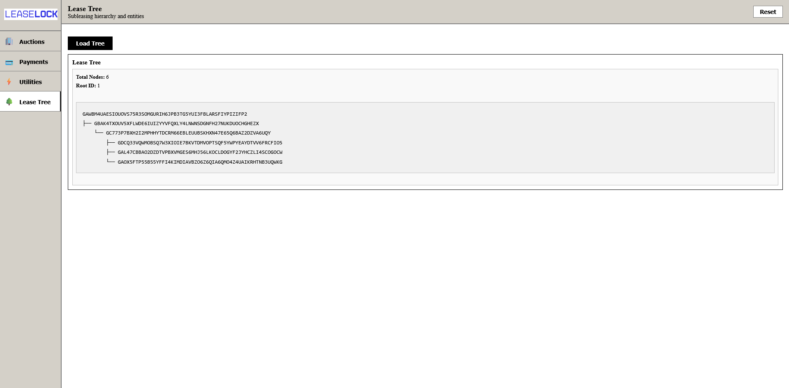
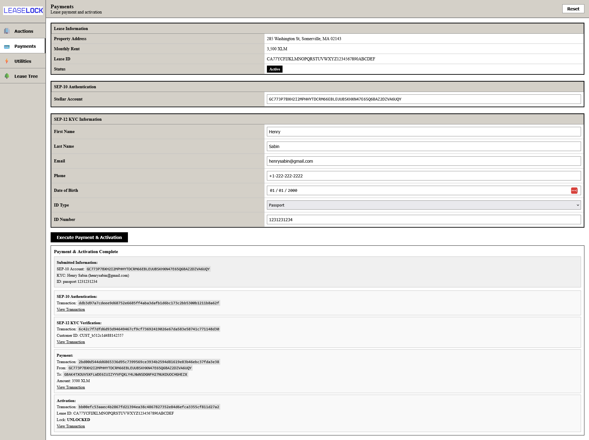
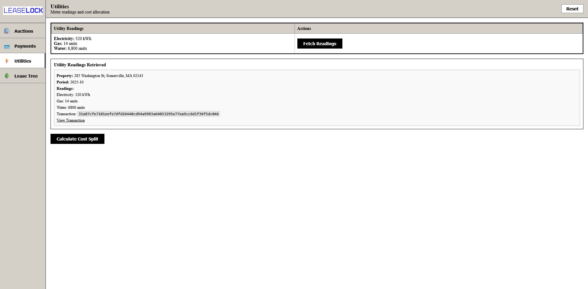
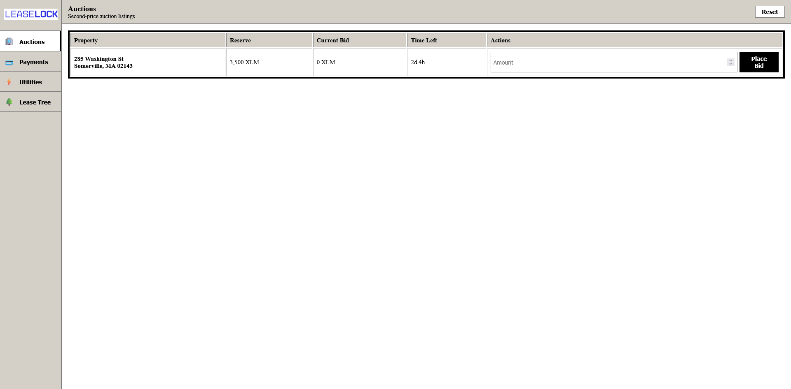
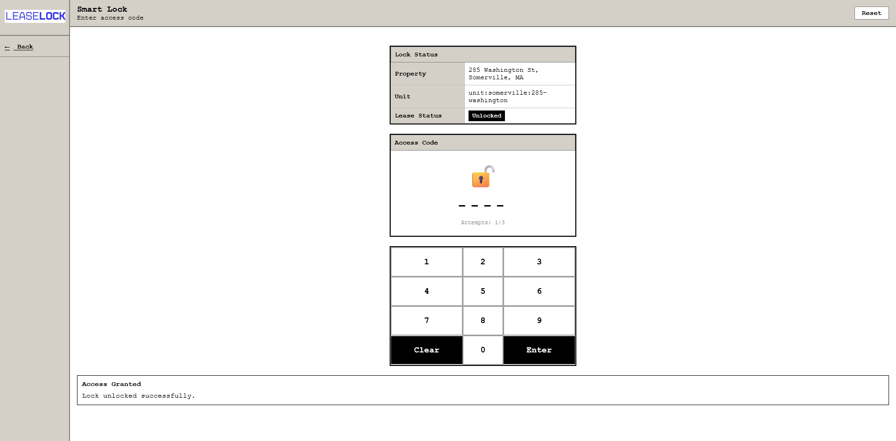

## a. Demo Video

https://www.loom.com/share/38787b9c5b314aefba5afc8ce63186b9

## b. Screenshots

*Visual representation of the lease tree structure*

*Payments dashboard showing rent and transaction history*

*Utilities tracking and cost split interface*

*Auction functionality for property assets*

*Smart lock for immediate physical access upon lease/sublease*

## c. Smart contracts

### LeaseRegistry

Each lease/sublease takes the form of a LeaseRegistry smart contract, which contains information about the lessor, lessee, parent lease (if not top level), and terms of the lease (utilities, time). A landlord (lessor) role can create_master() for a root node, and tenants/subtenants (lessees) with the parent.lessee role can create_sublease() to sublet and accept a lease. Upon payment, an accepted lease is now active and emits LeaseActivated. This in turn enables physical access systems to function (mocked as a digital lock in the demo). Likewise, if rent is past due, a lease will be deactivated automatically.

### UtilitiesOracle

Any role (lessor, lessee) can get_reading() for utilities, which provides an amount in XLM that can be settled with the same payment system as the leases. This allows for granular protation of utilities based on exact consumption during a sublease.

## d. Technical Explanation

https://www.loom.com/share/8d06fd11a2334c8b8407584c5fac4d00

## e. Demo site

[Live Demo Site](https://leaselock.vercel.app)

## f. Public video and site

## g. Smart contract links on stellar.expert

LeaseRegistry: https://stellar.expert/explorer/testnet/contract/CDBFB6YDB55G7E5ZGOHYIYBLS745NVBU73TKLB6N6IT6XBKBWICNUW5I

UtilitiesOracle: https://stellar.expert/explorer/testnet/contract/CDDO7X23GQ7J3KXACSIFRIY6T7MESM5EACTX7ZAHRRQZZIW2LYUPIX77

## h. Extensions

Insurance verification via oracle

Move-out process and security deposit return via arbitrator